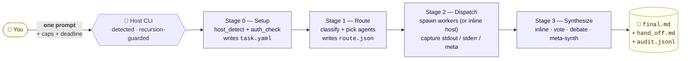

<div align="center">

# 🤖 auto-agents

### One prompt → many CLIs → one answer.<br/>Routed · Audited · Receipts on disk.

*Tell the host CLI (`claude` / `codex` / `opencode`):* **`use the best agent for this`**
*→ classify task → fan out to workers → synthesize → final.md.*

[](LICENSE)
[](#)
[](https://claude.ai/code)
[](#)
[](#)
[](#)
[](auto-agents/SKILL.md)

</div>



## What it does, in one minute

You have three coding CLIs installed (`claude`, `codex`, `opencode`). They're each best at different things — Claude at code-writing and research, Codex at code-review, OpenCode at math. **auto-agents** is a skill that sits inside whichever one you invoke (that's your **host**) and orchestrates the other two as **workers**:

1. **Detect the host** automatically (env-var → parent process chain → cached/asked, with `AUTO_AGENTS_HOST` override).
2. **Classify the task** from your prompt (code-write / code-review / math / idea / debate / research / quick-qa).
3. **Pick agent(s)** from the capability matrix — for `code-write` it's one agent inline; for `idea` it's all three with **meta-synth**; for `debate` it's all three with **two-round debate**.
4. **Dispatch workers** as subprocesses with budget caps; everything written to `runs/<task_id>/agents/<name>/`.
5. **Synthesize** into one `final.md` with attribution — every claim traces back to a specific worker's raw output.

Crash-safe. Resume-by-default. Every cost / decision on disk.

## Install

```bash
git clone https://github.com/deafenken/auto-agents.git
mkdir -p ~/.claude/skills
cp -r auto-agents/auto-agents ~/.claude/skills/
```

For Codex CLI:

```bash
mkdir -p ~/.codex/skills
cp -r auto-agents/auto-agents ~/.codex/skills/
```

Have the three CLIs on your `PATH`. The skill will only use the ones it can `--version` successfully — any missing one is recorded as unavailable in `task.yaml: workers_available` and escalated if the router wanted it.

## Trigger

From inside any of `claude` / `codex` / `opencode`:

| You say | Skill does |
|---|---|
| "use the best agent for this: <task>" | classify, route, dispatch one agent inline |
| "brainstorm <X> with all three" | fan out all three, **meta-synth** |
| "have codex audit what claude just wrote" | dispatch codex on the prior turn's output |
| "debate <position>" | two-round structured debate, host moderates |
| "settle this by vote: A or B?" | each agent votes, majority wins (or escalate) |

The skill **does not trigger** when one CLI is clearly enough and the user did not ask for fan-out — that's the host's job.

## Modes

`task.yaml: mode`:

- `auto` — router decides (default)
- `multi` — force all three available agents
- `single:<agent>` — skip router, dispatch only the named agent
- `dry-run` — write `route.json` + per-agent `invocation.md`, but do NOT spawn

Budget caps default to **$0.50 per-call / $2.00 per-task** — both editable in `task.yaml`.

## What's on disk after one task

```
runs/2026-05-12-1640-fix-cache-invalidation/
├── task.yaml                         host + prompt + caps + workers_available
├── route.json                        chosen agents + synthesis method + cost est
├── progress.jsonl                    append-only micro-step log
├── audit.jsonl                       append-only per-call cost + time
├── .heartbeat                        stage / step / pid / ts_utc
├── agents/
│   ├── claude/                       invocation.md / stdout.log / stderr.log / result.md / meta.json
│   ├── codex/...
│   └── opencode/...
├── synthesis/
│   ├── method.md                     which method was used
│   ├── intermediate/                 vote tally / debate rounds / meta-synth input
│   └── final.md                      the one answer, with attribution
└── hand_off.md                       three-paragraph user-facing summary
```

Everything reproducible. Anything missing is grounds to re-run — re-running is idempotent.

## Integrity rules — what the skill will refuse to do

Eight non-negotiables in [`auto-agents/references/integrity-rules.md`](auto-agents/references/integrity-rules.md):

1. **No silent agent swap** — if the chosen agent is unavailable, escalate; never substitute behind your back.
2. **Attribution mandatory** — every claim in `final.md` names the source agent.
3. **Budget gate** — per-call and per-task caps; over → escalate.
4. **Auth check upfront** — workers `--version` checked in Stage 0; doomed calls never happen.
5. **No CLI flag fabrication** — one known-good invocation each; raw errors surface; no guessing.
6. **Recursion guard** — `AUTO_AGENTS_DEPTH ≥ 1` refuses; host never spawns itself.
7. **Idempotent micro-steps** — every re-run reads disk and resumes from the last `ok` step.
8. **All state on disk** — nothing the next stage needs lives in the agent's memory.

## Tree

```
auto-agents/             ← the only skill folder (Claude Code + Codex find it here)
├── SKILL.md
├── agents/openai.yaml
├── references/          host-cli-modes · agent-matrix · routing-policy · synthesis-methods · state-contract · integrity-rules
└── assets/              host_detect · auth_check · route · dispatch · synthesize · budget · invoke_* · supervisor.sh
README.md  README.zh-CN.md
CLAUDE.md
docs/                    hero image (cosmetic)
```

## Long-running protocol

Tasks can be multi-minute (debate, three-way meta-synth, big code reviews). `assets/supervisor.sh` is an outer bash loop that:

- Restarts the inner pass if it dies (up to `--max-restarts`, default 50).
- Honors `STOP` / `PAUSE` sentinels under `runs/<task_id>/`.
- Sleeps until `wait_until.txt` (used when a worker hits a rate-limit / quota).
- Kills the inner pass if `.heartbeat` hasn't moved in `--heartbeat-stall-sec` (default 900s).

```bash
./auto-agents/assets/supervisor.sh runs/2026-05-12-1640-fix-cache-invalidation
```

## License

MIT. See [LICENSE](LICENSE).

---

<sub>One CLI is good. Three CLIs picking each other's strongest moments is better — when the orchestration is *honest* about who said what.</sub>
