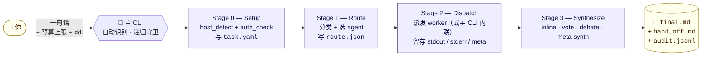

<div align="center">

# 🤖 auto-agents

### 一句话 → 多个 CLI → 一份答案。<br/>路由 · 审计 · 全程留痕。

*对主 CLI（`claude` / `codex` / `opencode`）说：* **`挑最合适的 agent 解决`**
*→ 分类任务 → 派发 worker → 合成 → final.md。*

[](LICENSE)
[](#)
[](https://claude.ai/code)
[](#)
[](#)
[](#)
[](auto-agents/SKILL.md)

</div>



## 一分钟说清在干什么

你装了三个编码 CLI（`claude` / `codex` / `opencode`），它们各有所长 —— Claude 擅长写代码 + 调研，Codex 擅长 code review，OpenCode 擅长数学推理。**auto-agents** 是一个 skill，它寄生在你正在用的那个 CLI 里（即**主 CLI**），把另外两个当 **worker** 调度：

1. **自动识别主 CLI**（环境变量嗅探 → 父进程链回溯 → 缓存 / 问一次，`AUTO_AGENTS_HOST` 可强制覆盖）。
2. **分类任务**（code-write / code-review / math / idea / debate / research / quick-qa）。
3. **挑 agent**：单 agent 任务直接 inline；`idea` 三个 agent 一起 + **meta-synth**；`debate` 三个 + **两轮辩论**。
4. **派发 worker** 走子进程，预算可控，所有内容写到 `runs/<task_id>/agents/<name>/`。
5. **合成** 成单份 `final.md`，**强制署名**：每条结论都能追到某个 worker 的原始输出。

崩了能续，默认续跑；每一笔成本、每一个决定都在硬盘上。

## 安装

```bash
git clone https://github.com/deafenken/auto-agents.git
mkdir -p ~/.claude/skills
cp -r auto-agents/auto-agents ~/.claude/skills/
```

Codex CLI：

```bash
mkdir -p ~/.codex/skills
cp -r auto-agents/auto-agents ~/.codex/skills/
```

三个 CLI 都在 `PATH` 里。skill 会做 `--version` 检查，没装的标记为 unavailable，路由器一旦想用它会**升级到人**而不是悄悄换另一个。

## 怎么触发

在 `claude` / `codex` / `opencode` 任意一个里：

| 你说 | skill 做什么 |
|---|---|
| "挑最合适的 agent 来做：<任务>" | 分类、路由、单 agent inline |
| "三个 agent 一起头脑风暴 <X>" | 三个并发 → **meta-synth** |
| "让 codex 审一下刚才 claude 写的" | 单独派发 codex 审上一轮输出 |
| "辩论 <某立场>" | 两轮结构化辩论，主 CLI 总结 |
| "投票决定：A 还是 B？" | 每个 agent 各投一票，多数胜（无多数则升级） |

主 CLI 一个人就能搞定 + 你没要求扩散时，**skill 不触发**。

## 模式

`task.yaml: mode`：

- `auto` — 路由器决定（默认）
- `multi` — 强制三个可用 agent 全上
- `single:<agent>` — 跳过路由器，只派指定 agent
- `dry-run` — 写 `route.json` 和 invocation.md 但不真的派发子进程

预算默认上限：**单次调用 $0.50 / 整任务 $2.00**，都可在 `task.yaml` 里改。

## 一个任务跑完的盘上结构

```
runs/2026-05-12-1640-fix-cache-invalidation/
├── task.yaml                         主 CLI + prompt + 预算 + workers_available
├── route.json                        选的 agent + 合成方式 + 估价
├── progress.jsonl                    追加式微步日志
├── audit.jsonl                       追加式每次调用的成本 + 耗时
├── .heartbeat                        stage / step / pid / ts_utc
├── agents/
│   ├── claude/                       invocation.md / stdout.log / stderr.log / result.md / meta.json
│   ├── codex/...
│   └── opencode/...
├── synthesis/
│   ├── method.md                     用的什么合成方式
│   ├── intermediate/                 投票表 / debate 各轮 / meta-synth 输入
│   └── final.md                      最终答案 + 署名
└── hand_off.md                       三段给人看的总结
```

全部可复现，缺啥就重跑 —— 重跑是幂等的。

## 完整性铁律 —— skill 不会偷做的事

[`auto-agents/references/integrity-rules.md`](auto-agents/references/integrity-rules.md) 里列了 8 条不可妥协的规则：

1. **不偷换 agent** —— 选中的 agent 不可用就升级到人，不背后替换。
2. **必须署名** —— `final.md` 里每条结论都要点名出处 agent。
3. **预算闸** —— 单次 / 整任务两条上限，超就升级。
4. **预先做 auth check** —— Stage 0 跑 `--version`；不让必败的调用真的烧钱。
5. **不瞎猜 CLI 参数** —— 每个 CLI 只有一个公认能跑的命令；失败就把原始错误抛出。
6. **递归守卫** —— `AUTO_AGENTS_DEPTH ≥ 1` 直接拒绝；主 CLI 永远不会把自己当 worker 启动。
7. **微步幂等** —— 重跑读盘、从上一个 `ok` 微步继续。
8. **状态全在盘上** —— 下一阶段需要的东西从不靠 agent 自己记。

## 仓库结构

```
auto-agents/             ← 唯一一个 skill 文件夹（Claude Code + Codex 都在这找）
├── SKILL.md
├── agents/openai.yaml
├── references/          host-cli-modes · agent-matrix · routing-policy · synthesis-methods · state-contract · integrity-rules
└── assets/              host_detect · auth_check · route · dispatch · synthesize · budget · invoke_* · supervisor.sh
README.md  README.zh-CN.md
CLAUDE.md
docs/                    hero 图（装饰性）
```

## 长任务守护

debate / 三方 meta-synth / 大代码审查 都可能跑几分钟到几十分钟。`assets/supervisor.sh` 是个外层 bash 循环：

- 内层崩了自动重启（默认 `--max-restarts 50`）。
- 遵守 `runs/<task_id>/` 下的 `STOP` / `PAUSE` 哨兵文件。
- 看到 `wait_until.txt` 就睡到那个时间（worker 撞限速时用）。
- `.heartbeat` 超过 `--heartbeat-stall-sec`（默认 900s）没更新就杀掉重启。

```bash
./auto-agents/assets/supervisor.sh runs/2026-05-12-1640-fix-cache-invalidation
```

## 许可证

MIT，详见 [LICENSE](LICENSE)。

---

<sub>一个 CLI 够用，三个 CLI 各取所长更香 —— 前提是编排过程对"谁说了什么"诚实。</sub>
